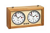

# Chess Clock 

[](https://www.codefactor.io/repository/github/cschladetsch/chessclock)[](./LICENSE.txt)[](https://github.com/cschladetsch/chessclock/releases/latest)

*ChessClock* is a somewhat ambitious project to make an elaborate Chess clock base on *Raspberry Pi*, and a relatively large screen.

There are many ideas about [Features](../../wiki/Features) that may never see the light of day.

This image is is a conceptual render of the final product. It only shows relative sizes of each major component (body, screen, rocker), but you get the idea:


## Ingredients
* [Hardware](../../wiki/Hardware)
* 3d Printed body with custom rocker switch.
* SDL 2.0
* Art

## Hardware/Software setup 
TODO

### SDL 2.0
Latest and last attempt to get a system up and running that can be dev'd on Win10 and built on device.

#### Build SDL for Windows

Prerequisites:
* [VncViewer](https://www.realvnc.com/en/connect/download/viewer/)
* [GitBash](https://github.com/git-for-windows/git/releases/download/v2.31.1.windows.1/Git-2.31.1-64-bit.exe)
* [Doxygen](https://doxygen.nl/files/doxygen-1.9.1-setup.exe).
* [Cmake](https://cmake.org/download/)
* [Make](https://ixpeering.dl.sourceforge.net/project/ezwinports/make-4.3-without-guile-w32-bin.zip)

```bash
$ git submodule update --init --recursive
$ cd ThirdParty/SDL
$ mkdir build && cd build && cmake .. && start main.sln
```
Now, build the library using Ctrl-Shift-B and close visual studio.

#### Build SDL for Pi
```bash
$ git submodule update --init --recursive
$ cd ThirdParty/SDL
$ configure --host=armv7l-raspberry-linux-gnueabihf --disable-pulseaudio --disable-esd --disable-video-mir --disable-video-wayland --disable-video-x11 --disable-video-opengl
$ mkdir build && cd build && cmake .. && make
```

#### Building the ChessClock-SDL App

```bash
$ cd ChessClock-SDL && mkdir build && cmake .. && start *.sln
```
Build using Ctrl-Shit-B.
Run using F5.

### Urho3d
We're assuming at least a Pi 3B+ and Raspian.

You will need all the RAM you have to build Urho3d. Start by booting into command-line rather than the *gui*. Do this via the command `sudo rasppi-config` and change the boot to go directly to the CLI.

```bash
$ sudo apt-get install libgles2-mesa-dev            # need gles2
$ sudo apt-get install libxext-dev
$ git clone https://github.com/urho3d/Urho3D.git    # engine
$ cd Urho3d && mkdir build && cd build && cmake .. 
$ make  # be patient
$ # change back to booting to GUI after setting minimum GPU RAM to 128M RAM (or more, depending on hardware)
```
*NOTE: This doesn't build on device (too little ram), and cross-compiling to Pi is a PITA*

See Building ChessClock.

### Android
To Install LineageOs 17.1:
1. Install Etcher
1. Flash drive with lineage-17.1-20201108-UNOFFICIAL-KonstaKANG-rpi3
1. Boot pi with card
1. Install F-Droid via built-in Browser
1. Install Termux
1. Alt-Shift-+/- to change font size of Terminal
1. Fail to get touch screen working with Android, move back to *Native*.

## Building ChessClock

```bash
$ git clone ChessClock
$ mkdir build && cd build && cmake .. && make
$ ./Release/ChessClock
```
This turned into a dead end. First, Android on Pi is a resource hog. Second, display/touch sensors turned out to not work with Android.

TODO: revisit idea of basing on Andrdoin on Pi.

## Future Work

* Android Connectivity via Bluetooth
* [Lichess API](https://lichess.org/api)

## Wiki

There is a developing [Wiki](../../wiki/Home) in progress.

## Jira

There's a [Jira board](https://chessclock.atlassian.net/secure/RapidBoard.jspa?rapidView=1&selectedIssue=CHES-3) to keep track of things. TODO: Update Jira with `Epics`.

## Chess Clock Body

The body is self-contained and runs off a LiPo battery. A means to readily pull apart the shell, to turn the device on and off, and to change the battery are all required.

### Rocker

This is a key component of the project. If this doesn't feel/work well, the project fails.

#### Switches

Want micro-switch at the end of travel:


## Connecting ADB

```bash
$ adb connect ip-address:5555 # find the ip-address on Pi/About settings
```

## Art

Various art assets will be required, such as:

* Fonts
* Backgrounds
* Animations
* Transitions
* Sound Effects

